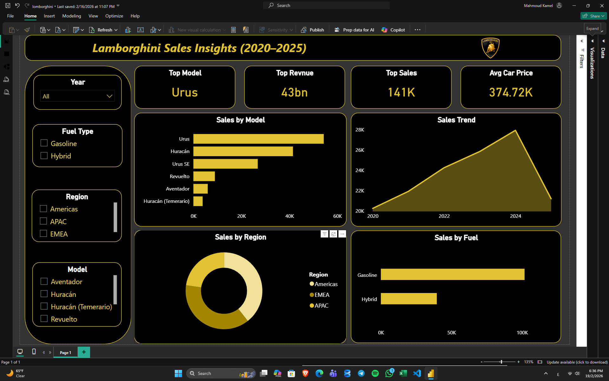

# 🏎️ Lamborghini Sales Insights Dashboard (2020–2025)

## 📌 Overview

This project presents an interactive Power BI dashboard analyzing Lamborghini sales performance from 2020 to 2025.

## 🎯 Objectives

* Analyze sales trends over time
* Identify top-performing models
* Compare regional performance
* Understand fuel type distribution

## 🧰 Tools Used

* Power BI
* Excel
* DAX

## 📊 Key Insights

* Urus is the top-selling model
* Total revenue reached 43 Billion
* Sales peaked in 2024
* Gasoline vehicles dominate hybrid

## 📷 Dashboard Preview

## 📁 Project Files

* lomborghini dashboard.pbix

## 📬 Contact

Feel free to connect with me for data analysis projects.
